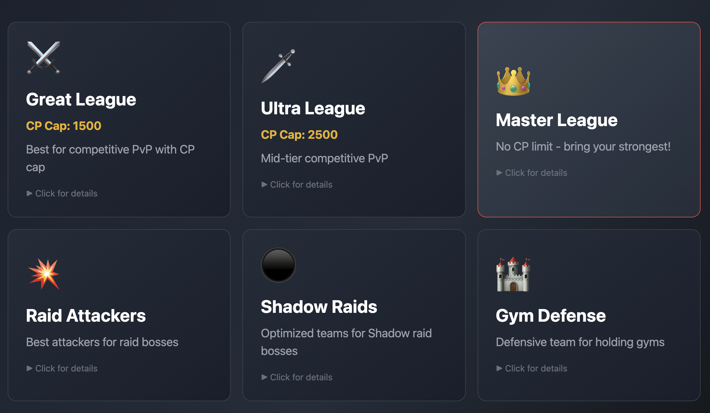
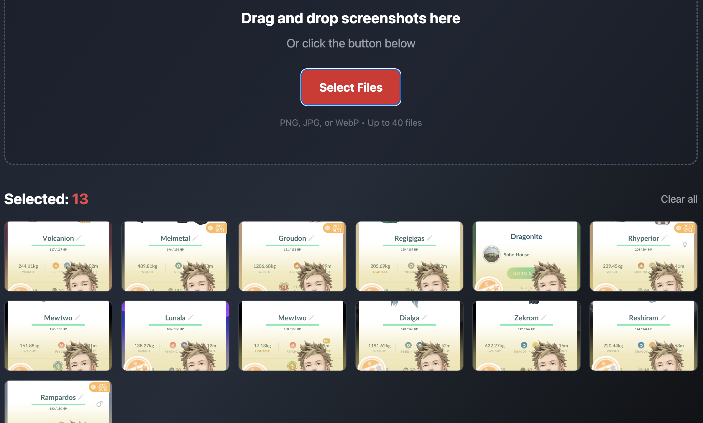
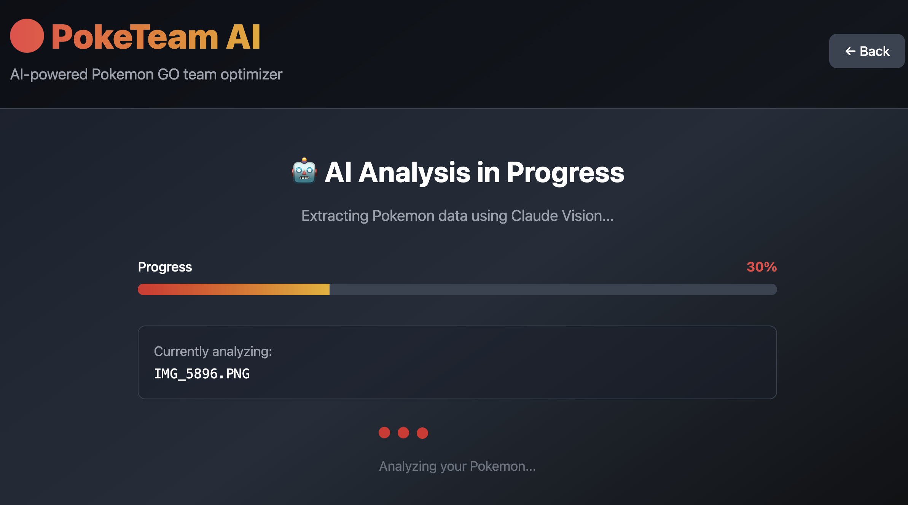
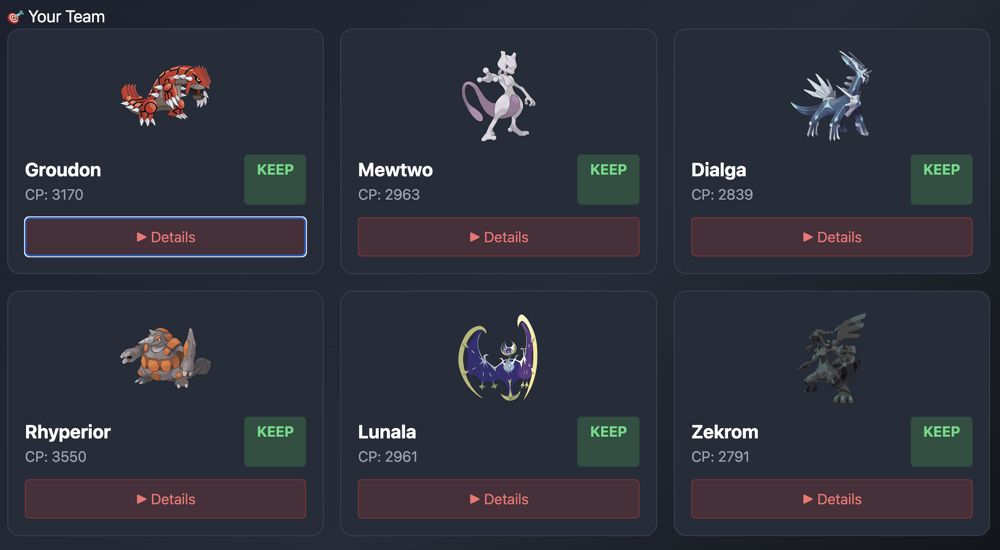

# PokéTeam AI 🔴⚪

**AI-powered Pokémon GO team optimizer.** Upload screenshots of your Pokémon, get instant KEEP / TRANSFER recommendations with reasoning — powered by Claude's vision capabilities.

🔗 **Live demo:** [poketeam-ai.vercel.app](https://poketeam-ai.vercel.app) 



---

## ✨ What it does

Managing hundreds of Pokémon in Pokémon GO is tedious. PokéTeam AI turns it into one step:

1. **Upload screenshots** of your Pokémon storage (JPEG or PNG)
2. **AI analyzes** each Pokémon — CP, typing, and battle relevance
3. **Get a team recommendation:** which Pokémon to keep, which to transfer, and *why*, plus suggested actions and an overall team summary

Each recommendation card shows the decision at a glance, with collapsible per-Pokémon details for the reasoning.

## 🏗️ Architecture

```
Browser (React + Vite)
   │  image as base64 + mimeType
   ▼
Vercel Serverless Function (api/analyze.js, POST only)
   │  secure server-side API call
   ▼
Claude API (claude-haiku-4-5)
   │  structured JSON: decision, reason, actions, summary
   ▼
TeamRecommendation component → interactive cards
```

**Why a serverless proxy?** The Anthropic API key never touches the browser. The frontend sends the image to `api/analyze.js`, which holds the key as a Vercel environment variable and forwards the request. This is the standard secure pattern for shipping AI features in client-side apps.

**Why Claude Haiku?** Vision-capable and ~10x cheaper per image than larger models — the difference between a hobby project and a sustainable freemium product.

## 🛠️ Tech stack

| Layer | Technology |
|---|---|
| Frontend | React 18, Vite, Tailwind CSS |
| Backend | Vercel Serverless Functions (Node.js) |
| AI | Anthropic Claude API (Haiku, vision) |
| Deployment | Vercel |

## 🧠 Engineering highlights

Real problems solved while building this — the interesting part:

- **Secure key handling:** migrated from a client-side `VITE_` env variable to a serverless proxy so the API key is never exposed in the bundle.
- **Robust JSON parsing:** Claude sometimes wraps JSON responses in markdown code fences. The parser strips ```` ```json ```` fences before `JSON.parse()` — a small detail that prevents intermittent "silent failure" states.
- **Dynamic media types:** the API request passes the real `file.type` (`image/png`, `image/jpeg`) through the request body instead of hardcoding one, so all common screenshot formats work.
- **Data contracts between layers:** a key-name mismatch between the extraction logic and the display component (`team` vs `pokemon`) caused a "no data" state despite successful API responses. Fixed by passing the full objects through unchanged — and it's now a lesson baked into the code structure.
- **Prompt engineering for structured output:** the prompt constrains Claude to return exactly `decision` (KEEP/TRANSFER), `reason`, and `actions` per Pokémon plus a `summary`, making the response directly renderable.

## 🚀 Run locally

```bash
# 1. Clone
git clone https://github.com/ElinaG3/poketeam-ai.git
cd poketeam-ai

# 2. Install
npm install

# 3. Environment variable (server-side only — no VITE_ prefix!)
#    Create .env.local:
ANTHROPIC_API_KEY=your-key-here

# 4. Run with Vercel dev so the serverless function works locally
npx vercel dev
```

> **Note:** `npm run dev` alone won't serve `api/analyze.js` — use `vercel dev` to run the frontend and the serverless function together.

## 📸 Screenshots

| Upload | Analysis | Recommendations |
|---|---|---|
|  |  |  |

## 🗺️ Roadmap

- [ ] User accounts & saved teams (Supabase)
- [ ] Usage-based freemium tiers
- [ ] IV calculator & league-specific rankings
- [ ] Multilingual UI (EN / DE / RU)
- [ ] Raid team planner

## 📄 License

MIT

---

*Built by [Elina](https://github.com/ElinaG3) — part of a portfolio exploring practical AI integration in real products.*

